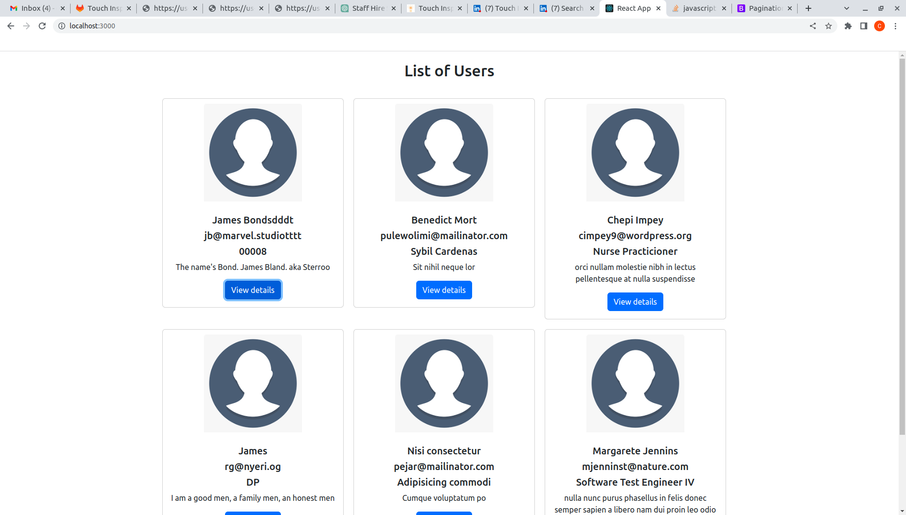
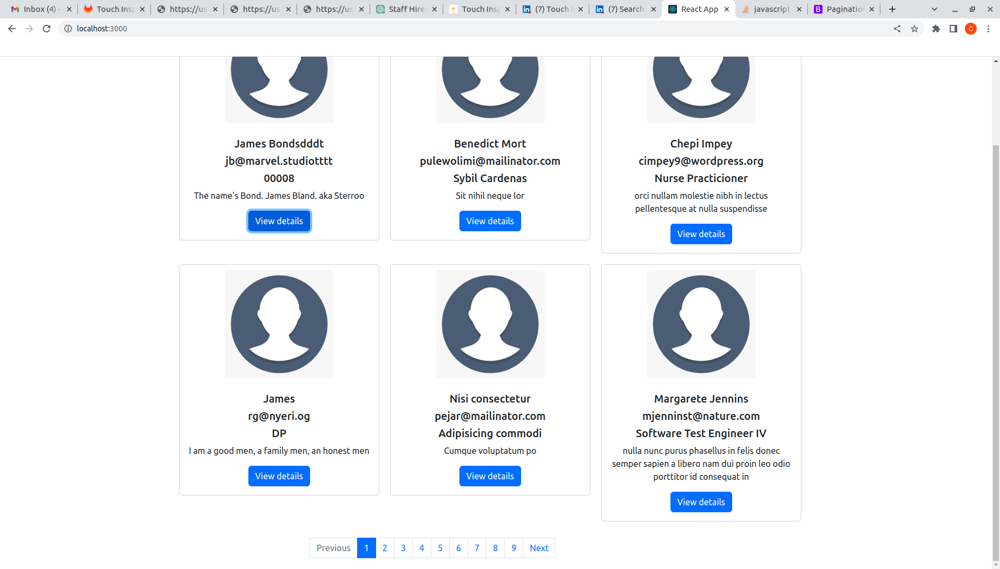
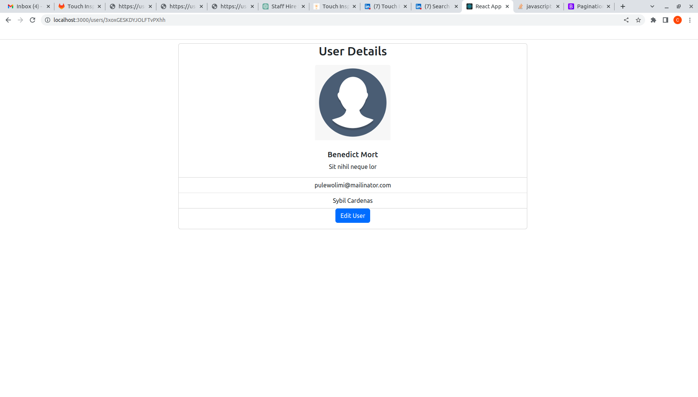
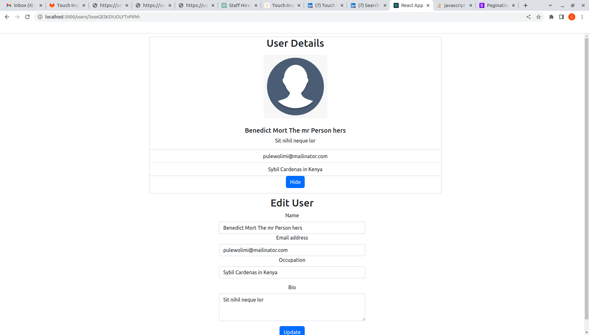

# Touchinspiration test Application
## Technologies used 
- React

## Packages used 
- `react-router-dom` 
## Run the application
 Clone the repository into a folder and open the folder in a terminal and type the following commmand 
 - `npm install` to install the packages 
 - `npm start` to run the application 

 ## NOTE
 ## Challenges
- The requirements needs to use redux, which I'm familiar with but not quite conversant with it. I have some previous knowledge about `REDUX` but stopped using it some times back after reading many blogs that prefer `useState` hook or `useContext`. I can still however leaern it in a day if it used at the organization.
- The endpoint for the `PATCH` operation seems to have an issue but the updates works. It only needs the users to refresh the page to see the changes
### List of users

### Pagination

### User Details

### Updated user
